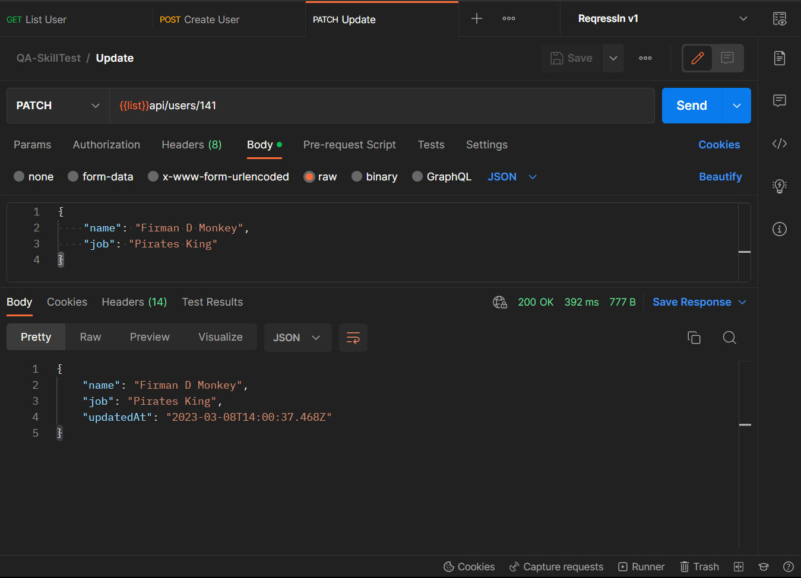

## [Score : 10] Please go to https://reqres.in/ After that, please hit following URL endpoint using POSTMAN with correct method and screenshot the result (both Body Request (if any) and Body Response)

1. [https://reqres.in/](https://reqres.in/) **GET** List User
2. [https://reqres.in/](https://reqres.in/) **POST** Create using your own data
3. [https://reqres.in/](https://reqres.in/)**PATCH** Update your user id in point b

## Answer:

1. [https://reqres.in/](https://reqres.in/) **GET** List User


### Response:

```
{
    "page": 2,
    "per_page": 6,
    "total": 12,
    "total_pages": 2,
    "data": [
        {
            "id": 7,
            "name": "sand dollar",
            "year": 2006,
            "color": "#DECDBE",
            "pantone_value": "13-1106"
        },
        {
            "id": 8,
            "name": "chili pepper",
            "year": 2007,
            "color": "#9B1B30",
            "pantone_value": "19-1557"
        },
        {
            "id": 9,
            "name": "blue iris",
            "year": 2008,
            "color": "#5A5B9F",
            "pantone_value": "18-3943"
        },
        {
            "id": 10,
            "name": "mimosa",
            "year": 2009,
            "color": "#F0C05A",
            "pantone_value": "14-0848"
        },
        {
            "id": 11,
            "name": "turquoise",
            "year": 2010,
            "color": "#45B5AA",
            "pantone_value": "15-5519"
        },
        {
            "id": 12,
            "name": "honeysuckle",
            "year": 2011,
            "color": "#D94F70",
            "pantone_value": "18-2120"
        }
    ],
    "support": {
        "url": "https://reqres.in/#support-heading",
        "text": "To keep ReqRes free, contributions towards server costs are appreciated!"
    }
}
```

2. [https://reqres.in/](https://reqres.in/) **POST** Create using your own data


### Response:

```
{
    "name": "Firman Aji Prasetyo",
    "job": "Software Quality Assurance",
    "id": "141",
    "createdAt": "2023-03-08T13:52:07.941Z"
}
```

3. [https://reqres.in/](https://reqres.in/)**PATCH** Update your user id in point b



### Response:

```
{
    "name": "Firman D Monkey",
    "job": "Pirates King",
    "updatedAt": "2023-03-08T14:00:37.468Z"
}
```
