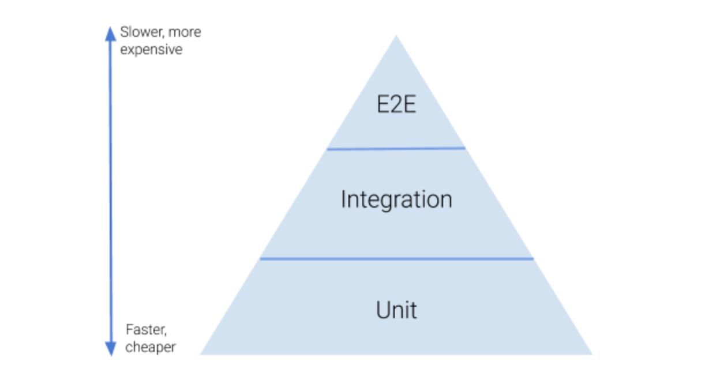

## Please describe this picture based on your experience in software testing

## Answers:

1. Unit Testing:  
   Ini adalah jenis pengujian yang dilakukan pada tingkat kode. Tujuannya adalah untuk memastikan bahwa setiap unit (fungsi atau metode) dalam kode bekerja dengan benar. Unit testing biasanya dilakukan oleh developer.

2. Integration Testing:  
   Jenis pengujian ini bertujuan untuk memastikan bahwa unit-unit yang diuji secara terpisah dapat berfungsi dengan baik ketika digabungkan menjadi sebuah sistem. Integration testing biasanya dilakukan oleh tim QA.

3. End-to-End Testing:  
   Ini adalah jenis pengujian yang melibatkan seluruh sistem atau aplikasi untuk memastikan bahwa semuanya berfungsi dengan baik dan dapat memenuhi kebutuhan bisnis atau pengguna. End-to-end testing biasanya dilakukan oleh tim QA.

Testing Pyramid adalah struktur pengujian perangkat lunak yang terdiri dari tiga lapisan pengujian: unit, integrasi, dan end-to-end. Prinsip "semakin lama semakin mahal, dan semakin cepat semakin murah" menjelaskan bahwa semakin tinggi lapisan pengujian, semakin sedikit pengujian yang dilakukan, namun biaya dan waktu yang dibutuhkan semakin tinggi. Dengan mengikuti Testing Pyramid, tim QA dan pengembang dapat memastikan kualitas aplikasi atau sistem dengan efisien dan efektif.
